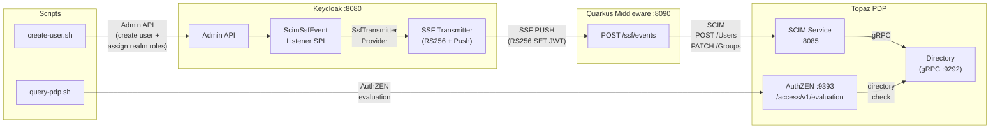

# Keycloak SSF + Topaz PDP: Group-Based Authorization with SCIM and AuthZEN

A proof-of-concept demonstrating how [Keycloak](https://www.keycloak.org/) can leverage the [Shared Signals Framework (SSF)](https://openid.net/specs/openid-sharedsignals-framework-1_0.html) to send [SCIM](https://scim.cloud/) events to a stateful Policy Decision Point ([Topaz](https://www.topaz.sh/)), ensuring the PDP always has the latest user and group membership state when evaluating authorization policies via the [AuthZEN](https://openid.github.io/authzen/) protocol.

This demo uses Keycloak's **native SSF Transmitter** infrastructure — custom SCIM event types are registered via the `SsfEventProviderFactory` SPI and dispatched through the built-in SET signing (RS256) and push delivery pipeline, including stream management and outbox-based async delivery.

Inspired by [How AuthZEN and Shared Signals (CAEP) Complement Each Other](https://openid.net/how-authzen-and-shared-signals-caep-complement-each-other).

## Architecture



**Flow:**

1. A user is created in Keycloak via the Admin API, optionally with realm role assignments.
2. A custom Keycloak `EventListenerProvider` fires on user creation and realm role mapping events. It builds a custom `SsfEvent` and dispatches it through the native SSF Transmitter pipeline:
   - The `SsfEventProviderFactory` registers two custom SCIM event types in the SSF registry.
   - The `SecurityEventTokenMapper.generateSyntheticEvent()` builds a properly structured SET.
   - The `SecurityEventTokenDispatcher.dispatchEvent()` signs it with RS256 (using realm keys) and pushes it to the configured SSF receiver.
3. The Quarkus middleware receives the RS256-signed SET JWT and:
   - For user creation events (`urn:ietf:params:scim:event:feed:add`): forwards a standard SCIM `POST /Users` request.
   - For role mapping events (`urn:ietf:params:scim:event:feed:addMember`): sends a SCIM `PATCH /Groups/{groupId}` request.
4. The SCIM service writes the user and group membership into the Topaz directory.
5. AuthZEN evaluation requests resolve group-based permissions: a user has `can_read` on a document if they are a `member` of a `reader` group associated with that document.

## Components

| Component | Technology | Port | Description |
|---|---|---|---|
| **Keycloak** | `quay.io/keycloak/keycloak:nightly` | 8080 | Identity provider with native SSF Transmitter and custom SCIM event SPI |
| **Quarkus Middleware** | Quarkus 3.x / Java 21 | 8090 | SSF receiver — processes SET JWTs and forwards SCIM operations to Topaz |
| **Topaz PDP** | `ghcr.io/aserto-dev/topaz:latest` | 9393 | Stateful authorization PDP exposing an AuthZEN evaluation endpoint |
| **Topaz SCIM Service** | `ghcr.io/aserto-dev/scim:latest` | 8085 (internal) | SCIM 2.0 API that writes users and group memberships into the Topaz directory |

## Prerequisites

- Java 21+
- Maven 3.9+
- Docker and Docker Compose

## Getting Started

### 1. Build everything

```bash
./build.sh
```

This runs three steps:

1. `mvn clean install` — compiles the Keycloak SPI and Quarkus middleware
2. `./build-scim-image.sh` — clones [aserto-dev/scim](https://github.com/aserto-dev/scim) and builds its Docker image locally
3. `docker compose build ssf-middleware` — builds the middleware Docker image

### 2. Start all services

```bash
docker compose up -d
```

Wait for Keycloak to startup

### 3. Try it out

Verify that an unknown user is denied:

```bash
./query-pdp.sh alice
# → "decision": false
```

Create a user without the reader role:

```bash
./create-user.sh alice
./query-pdp.sh alice
# → "decision": false  (user exists but is not a member of the readers group)
```

Create a user with the reader realm role:

```bash
./create-user.sh bob reader
./query-pdp.sh bob
# → "decision": true  (bob is a member of the readers group)
```

Attempting to assign a non-existent realm role will fail:

```bash
./create-user.sh charlie admin
# → Error: realm role 'admin' does not exist (HTTP 404)
```

## SSF Integration

This demo uses Keycloak's native SSF Transmitter. The integration consists of:

### Custom Event Types

Two SCIM event types are registered via the `SsfEventProviderFactory` SPI:

| Event Type URI | Class | Trigger |
|---|---|---|
| `urn:ietf:params:scim:event:feed:add` | `ScimUserCreatedEvent` | User created via Admin API |
| `urn:ietf:params:scim:event:feed:addMember` | `ScimGroupMemberAddedEvent` | Realm role assigned to user |

### SSF Receiver

The Quarkus middleware is configured as an OIDC client (`ssf-middleware`) with SSF receiver
attributes (`ssf.enabled=true`, `ssf.defaultSubjects=ALL`). The SSF stream is pre-configured
statically as client attributes in the realm JSON — the stream ID, push delivery endpoint,
and requested event types are all set at import time, so events flow as soon as Keycloak starts.

### SET Signing

SETs are signed with RS256 using Keycloak's realm keys (replacing the previous HMAC-SHA256
shared-secret approach).

## Authorization Model

The Topaz directory uses the following model:

```yaml
types:
  identity:
    relations:
      identifier: identity
  group:
    relations:
      member: identity
  document:
    relations:
      reader: group
    permissions:
      can_read: reader->member
```

The `can_read` permission on a document resolves via the chain:
`document:doc-1 --reader--> group:readers --member--> identity:bob`

Seed data (created automatically at startup):
- A sample document `doc-1`
- A `readers` group associated with `doc-1` via the `reader` relation

## Project Structure

```
.
├── pom.xml                                    # Root POM — builds all Java modules
├── docker-compose.yml                         # Container orchestration (includes topaz-init container)
├── build.sh                                   # Builds everything: Maven modules + Docker images
├── build-scim-image.sh                        # Builds the SCIM service Docker image from source
├── create-user.sh                             # Creates a Keycloak user with optional realm roles
├── query-pdp.sh                               # Queries the Topaz AuthZEN PDP
├── keycloak-scim-event-provider/              # Keycloak SPI extension (Java 21)
│   └── src/main/java/com/example/keycloak/scim/
│       ├── ScimUserCreatedEvent.java                # SsfEvent: SCIM user creation
│       ├── ScimGroupMemberAddedEvent.java           # SsfEvent: SCIM group membership
│       ├── ScimSsfEventProviderFactory.java         # Registers custom event types in SSF registry
│       ├── ScimSsfEventListenerProvider.java        # Dispatches events via SsfTransmitterProvider
│       └── ScimSsfEventListenerProviderFactory.java
├── ssf-scim-middleware/                       # Quarkus middleware (Java 21)
│   └── src/main/java/com/example/ssf/
│       ├── SsfEventResource.java                   # POST /ssf/events — receives SET JWTs
│       └── ScimForwarder.java                      # SCIM user creation + group membership
├── topaz/
│   ├── config.yaml                            # Topaz PDP configuration
│   ├── model/manifest.yaml                    # Directory model (identity, group, document types)
│   ├── data/objects.json                      # Seed objects (document, readers group)
│   ├── data/relations.json                    # Seed relations (document → readers group)
│   └── policy/authzen.rego                    # OPA policy (unused — AuthZEN uses directory check)
├── scim/
│   └── config.yaml                            # SCIM service configuration
└── keycloak/
    └── demo-realm.json                        # Demo realm with SSF transmitter, receiver client, and reader role
```

## Configuration

| Variable | Default | Used by | Description |
|---|---|---|---|
| `KC_FEATURES` | — | Keycloak | Set to `ssf` to enable the native SSF Transmitter |
| `KC_SPI_SSF_TRANSMITTER_DEFAULT_ALLOW_INSECURE_PUSH_TARGETS` | `false` | Keycloak | Allow HTTP (non-TLS) push endpoints in dev |
| `SCIM_ENDPOINT` | `http://scim:8085` | Middleware | Topaz SCIM service base URL |
| `KEYCLOAK_URL` | `http://localhost:8080` | Shell scripts | Keycloak base URL |
| `TOPAZ_AUTHZEN_URL` | `http://localhost:9393` | `query-pdp.sh` | Topaz AuthZEN endpoint base URL |

## Key Standards

- **SSF** — [OpenID Shared Signals Framework 1.0](https://openid.net/specs/openid-sharedsignals-framework-1_0.html)
- **SET** — [RFC 8417: Security Event Token](https://datatracker.ietf.org/doc/html/rfc8417)
- **SSF PUSH** — [RFC 8935: Push-Based SET Delivery](https://datatracker.ietf.org/doc/html/rfc8935)
- **SCIM** — [RFC 7644: SCIM Protocol](https://datatracker.ietf.org/doc/html/rfc7644)
- **AuthZEN** — [OpenID AuthZEN Authorization API 1.0](https://openid.github.io/authzen/)
