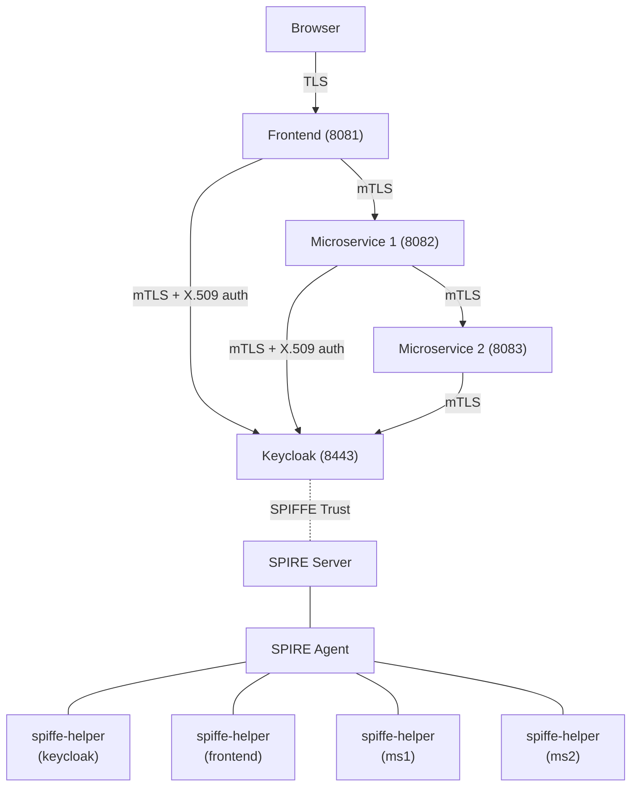
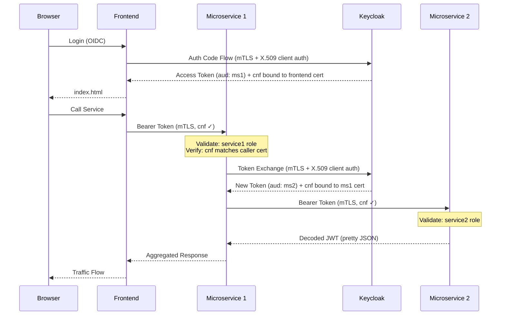

# SPIFFE X.509 Client Auth — Sender-Constrained Token Exchange with RBAC

Demonstrates zero-trust microservice authorization using SPIFFE/SPIRE for workload identity, mTLS for transport security, RFC 8705 sender-constrained tokens for proof-of-possession, and OAuth2 token exchange with role-based access control.

**This variant uses X.509 certificate authentication (`client-x509`).** Services authenticate to Keycloak by presenting their SPIFFE X.509-SVID certificates directly during the mTLS handshake — Keycloak extracts the client identity from the TLS layer. This is the simpler approach: no additional SPIRE infrastructure is needed beyond the X.509-SVIDs that already secure transport.

> **See also:** [spiffe-federation-sender-constrained-token-exchange-bearer-rbac](../spiffe-federation-sender-constrained-token-exchange-bearer-rbac/) — an alternative variant that replaces X.509 client auth with SPIFFE JWT-SVID client assertions, validated by Keycloak's federated SPIFFE identity provider. That approach adds a SPIRE OIDC Discovery Provider and uses application-layer JWT assertions instead of relying on TLS-layer certificate extraction.

## Architecture



### Components

- **SPIRE Server** — issues SPIFFE X.509-SVIDs (workload identity certificates) for the `demo.example.com` trust domain
- **SPIRE Agent** — runs with `pid: host` and uses Docker workload attestation (container labels) to identify workloads
- **spiffe-helper** (4 sidecars) — fetches and rotates X.509-SVIDs from the SPIRE Agent, writing certs to shared volumes
- **Keycloak** — OIDC provider with HTTPS, mTLS client auth, RFC 8705 certificate-bound tokens, and OAuth2 token exchange. Includes a custom protocol mapper to bind exchanged tokens to the client's certificate.
- **Frontend** — Quarkus web app with Keycloak SSO login (authorization code flow). Accepts browser TLS connections (no client cert required). Communicates with Keycloak and downstream services over mTLS.
- **Microservice 1** — validates the `service1` role and the sender-constrained token binding (`cnf` claim matches the caller's mTLS certificate), performs an OAuth2 token exchange (RFC 8693) to obtain a new sender-constrained token scoped to `microservice2`, then calls Microservice 2 over mTLS
- **Microservice 2** — validates the `service2` role and returns the decoded JWT as pretty-printed JSON. Requires mTLS for all connections.

### Security Model

| Layer | Mechanism | Purpose |
|-------|-----------|---------|
| Workload Identity | SPIFFE X.509-SVIDs | Cryptographic identity for every workload |
| Transport Security | mTLS (service-to-service) | Mutual authentication and encryption between services |
| Client Auth | X.509 certificate authentication | Services authenticate to Keycloak using their SPIFFE certificates — no shared secrets |
| Token Binding | RFC 8705 `cnf.x5t#S256` | Access tokens are bound to the sender's certificate, preventing token theft/replay |
| Token Binding Verification | `quarkus.oidc.token.binding.certificate=true` | Microservice 1 verifies the `cnf` thumbprint matches the caller's mTLS certificate |
| Authorization | RBAC via Keycloak roles | `service1` and `service2` realm roles gate access at each hop |
| Token Exchange | RFC 8693 | Microservice 1 exchanges the frontend's token for a new sender-constrained token scoped to Microservice 2 |

## Token Flow



Each access token contains a `cnf.x5t#S256` claim — the SHA-256 thumbprint of the sender's X.509 certificate. This binds the token to the specific SPIFFE identity that requested it, so a stolen token cannot be used by a different workload. Microservice 1 verifies this binding by comparing the `cnf` thumbprint against the caller's mTLS client certificate.

## Pre-configured Users

| User  | Email             | Password | Roles              | Expected Behavior                          |
|-------|-------------------|----------|--------------------|--------------------------------------------|
| ryan  | ryan@example.og   | password | service1, service2 | Full access through the entire chain       |
| alice | alice@example.og  | password | service1           | Access to Microservice 1, denied at 2      |
| alan  | alan@example.og   | password | (none)             | Denied at Microservice 1                   |

## Keycloak Configuration

All configuration is defined in `keycloak/demo-realm.json` and imported on startup:

- **Realm**: `demo` (SSL required for all requests)
- **Clients**:
  - `frontend` — X.509 certificate authentication, `tls.client.certificate.bound.access.tokens` enabled. Includes an audience mapper to add `microservice1` to issued tokens.
  - `microservice1` — X.509 certificate authentication, `standard.token.exchange.enabled`, `tls.client.certificate.bound.access.tokens` enabled. Includes an audience mapper for `microservice2` and a custom protocol mapper (`oidc-mtls-cnf-token-mapper`) that binds exchanged tokens to the client's mTLS certificate.
  - `microservice2` — bearer-only client with `tls.client.certificate.bound.access.tokens` enabled.
- **Scope Mappings**: The `microservice1` client is mapped to the `service1` and `service2` realm roles, ensuring exchanged tokens carry the user's roles.
- **Custom Provider**: A protocol mapper JAR (`keycloak/providers/`) uses Keycloak's `MtlsHoKTokenUtil.bindTokenWithClientCertificate` to add `cnf.x5t#S256` certificate binding to tokens issued via token exchange, which Keycloak does not do natively. https://github.com/keycloak/keycloak/issues/47314

## SPIFFE/SPIRE Configuration

- **Trust Domain**: `demo.example.com`
- **Node Attestation**: Join token (generated by `spire-init` container)
- **Workload Attestation**: Docker labels (`spiffe-workload: <name>`)
- **SPIFFE IDs**:
  - `spiffe://demo.example.com/keycloak`
  - `spiffe://demo.example.com/frontend`
  - `spiffe://demo.example.com/microservice1`
  - `spiffe://demo.example.com/microservice2`

Each workload gets an X.509-SVID with its SPIFFE ID in the SAN and the service name as a DNS SAN. Certificates are rotated automatically by the spiffe-helper sidecars.

## Prerequisites

- Docker and Docker Compose

## Quick Start

```bash
docker compose up --build
```

Once all services are healthy (~60 seconds):

1. Open https://localhost:8081
2. Accept the browser certificate warning (the SPIFFE CA is not in your trust store)
3. You will be redirected to Keycloak login
4. Log in with one of the test users (e.g., `ryan` / `password`)
5. Click **Call Microservice** to invoke the service chain
6. The response shows decoded JWTs at each hop — look for the `cnf` claim containing the certificate thumbprint

## Keycloak Admin Console

Access the Keycloak admin console at https://localhost:8443 with credentials `admin` / `admin`.

## Debugging

Keycloak starts with a JDWP debug agent on port 5005. Attach a remote debugger to `localhost:5005`.

## Cleanup

```bash
docker compose down -v
```

The `-v` flag removes volumes (SPIRE data, certificates). This is required for a clean restart since SPIRE workload entries are created during initial startup.

## Project Structure

```
├── docker-compose.yml              # Full stack orchestration (10 containers)
├── keycloak/
│   ├── Dockerfile                  # Custom Keycloak image with mTLS CNF mapper
│   ├── demo-realm.json             # Realm configuration (clients, users, roles, mappers)
│   ├── spiffe-helper.conf          # Certificate provisioning config for Keycloak
│   └── providers/                  # Custom Keycloak SPI (protocol mapper JAR)
│       ├── pom.xml
│       └── src/.../MtlsCnfMapper.java
├── spire/
│   ├── server.conf                 # SPIRE Server configuration
│   ├── agent.conf                  # SPIRE Agent configuration (Docker attestor)
│   ├── init.sh                     # Workload registration and join token generation
│   ├── agent-entrypoint.sh         # Agent startup script
│   ├── Dockerfile.init             # Alpine + SPIRE server CLI
│   ├── Dockerfile.agent            # Alpine + SPIRE agent
│   └── Dockerfile.helper           # Alpine + spiffe-helper
├── frontend/
│   ├── Dockerfile
│   ├── spiffe-helper.conf
│   └── src/                        # Quarkus web app (OIDC code flow)
├── microservice1/
│   ├── Dockerfile
│   ├── spiffe-helper.conf
│   └── src/                        # Quarkus service (token exchange + mTLS + cnf verification)
└── microservice2/
    ├── Dockerfile
    ├── spiffe-helper.conf
    └── src/                        # Quarkus service (bearer validation + mTLS)
```

## Tech Stack

- Java 21
- Quarkus 3.23.3 (TLS Registry, OIDC, OIDC Client, REST Client)
- Keycloak (nightly) with custom protocol mapper
- SPIRE 1.12.0 (Server, Agent, spiffe-helper 0.11.0)
- Docker Compose
